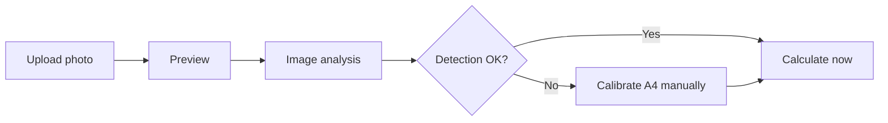
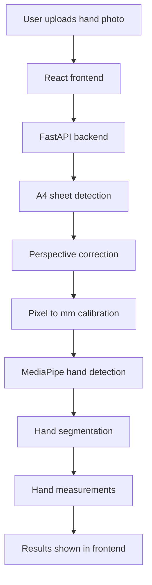

# Mittojen tunnistus kuvasta

Image measurement application for estimating hand measurements from a single image.
User places their hand on a A4 paper sheet, without covering any on the A4's corners (top left, top right, bottom right, bottom left)
A4 sheet is used as known size reference object, allowing application to detect the hand and estimate hand length and palm width.


## User flow



## Application Flow




## Technologies

| Area | Technologies |
|---|---|
| Frontend | React, Vite |
| Backend | Python, FastAPI |
| Image Processing | OpenCV, NumPy |
| Hand Detection | MediaPipe hand landmarks |
| Hand Segmentation (mainly for more accurate palm width) | OpenCV, GrabCut, contours, LAB/HSV colors |
| Deployment | Docker, Microsoft Azure |


## Project structure

```text
mittojen-tunnistus-kuvasta/
├── backend/
│   ├── app/
│   │   ├── models/
│   │   ├── routes/
│   │   ├── services/
│   │   └── main.py
│   ├── Dockerfile
│   └── requirements.txt
├── docs/
├── frontend/
│   ├── public/
│   └── src/
│       ├── components/
│       ├── config/
│       ├── pages/
│       ├── styles/
│       ├── App.jsx
│       ├── main.jsx
│       └── router.jsx
└── README.md
```
