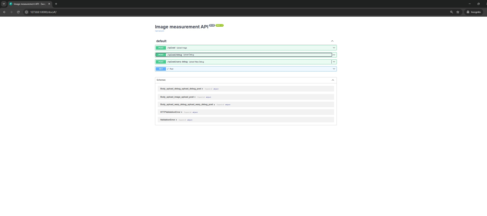
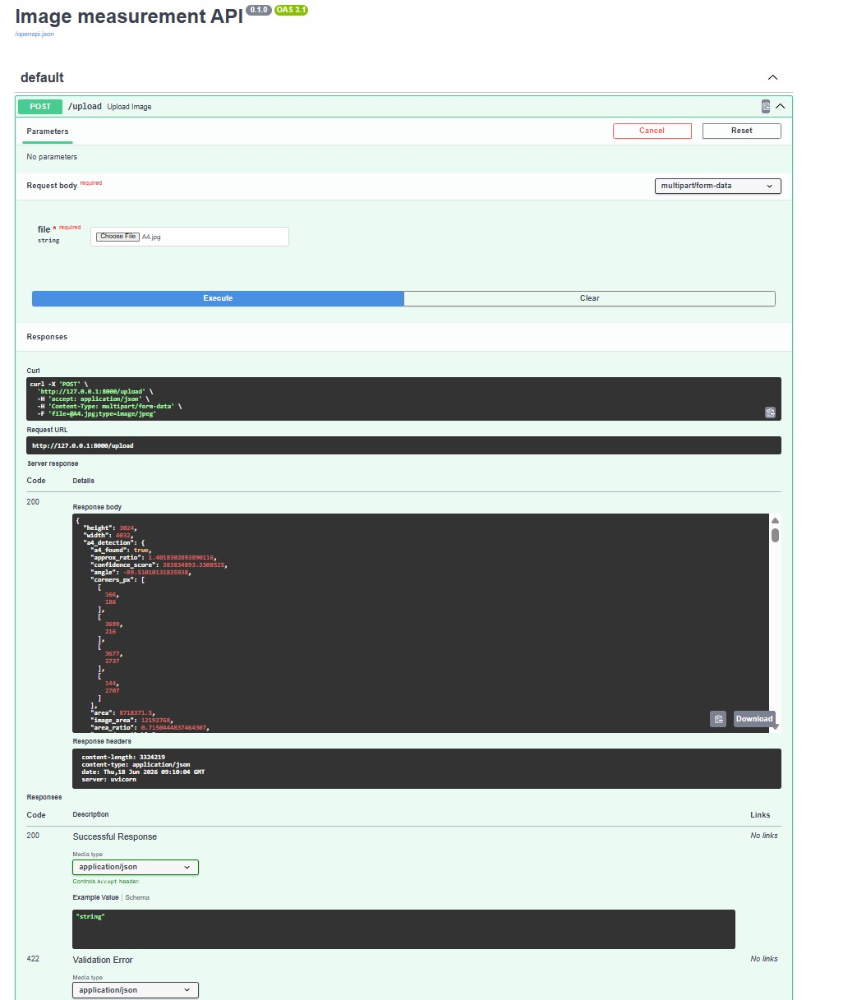
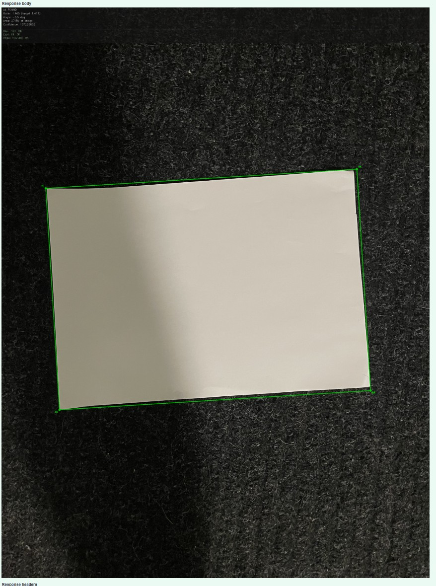
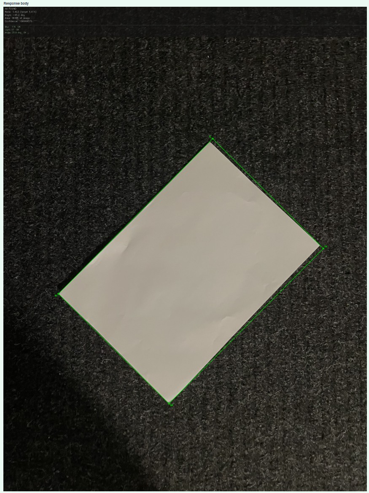
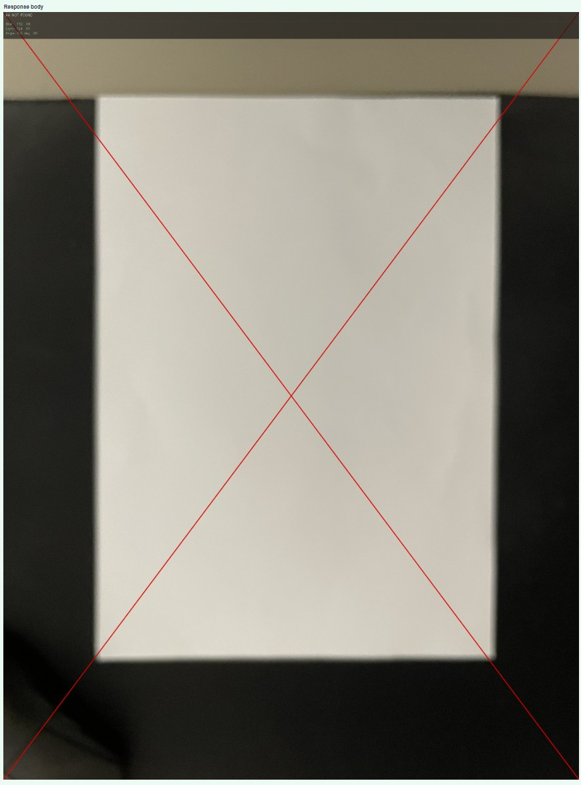
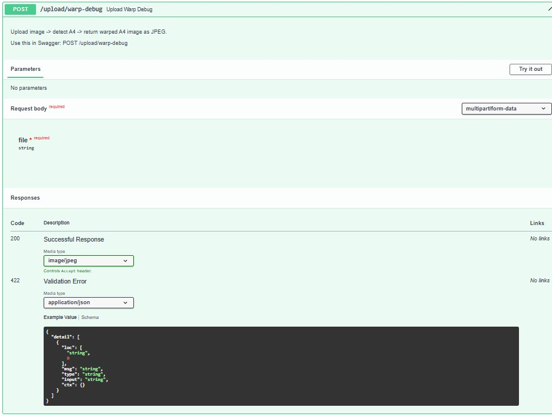
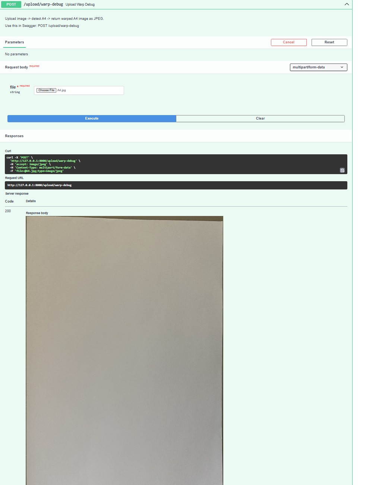

# Showcase of the current state of A4 detection

> The backend provides a FastAPI API for uploading images, detecting A4 paper, checking image quality, outlining the borders of A4 paper (reference object) and warping (straightening) the A4 paper.

## API endpoints - Features for image uploading and debugging



## Image upload and detection data

> The `/upload` endpoint processes an uploaded image and returns information such as image dimensions, detected A4 corners, aspect ratio, confidence score, and area values.




> The detector can also identify an A4 paper sheet photographed at an angle.




> Detection also works when the A4 paper is rotated




## Rejected image

> If an image does not meet the required quality conditions, it is rejected and marked with a red cross.




## Perspective correction


> The `/upload/warp-debug` endpoint detects the A4 paper, crops it from the image, and straightens it so that it looks as if the photo was taken directly from above.




> The response is a cropped and straightened image of the detected A4 paper.




### Final thoughts

> A4 detection logic is now in a good shape, after fixing critical mistakes in the code.

> One example from obstacles that caused headache was using 

```cv2.RETR_EXTERNAL``` in a4_detection.py on returning contours (shapes) from the image. This caused false positives by outlining the borders of the whole image.

This was fixed by trying out different approaches such as ```cv2.RETR_LIST```. This returns both outer and inner contours (shapes).


#### Backend Architecture

The backend follows a simple layered architecture:

- `main.py` creates and configures the FastAPI application.
- `routes/` contains the API endpoints that receive requests and return responses.
- `services/` contains the image-processing logic, such as A4 detection, image quality checks, debug overlays, and perspective correction.

>This structure separates API handling from image-processing logic. What I've learned in my previous studies, it is vital to have a clear and layered architecture, making the code easier to understand, maintain and develop further.