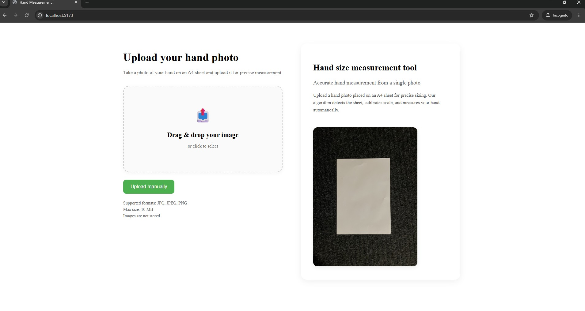
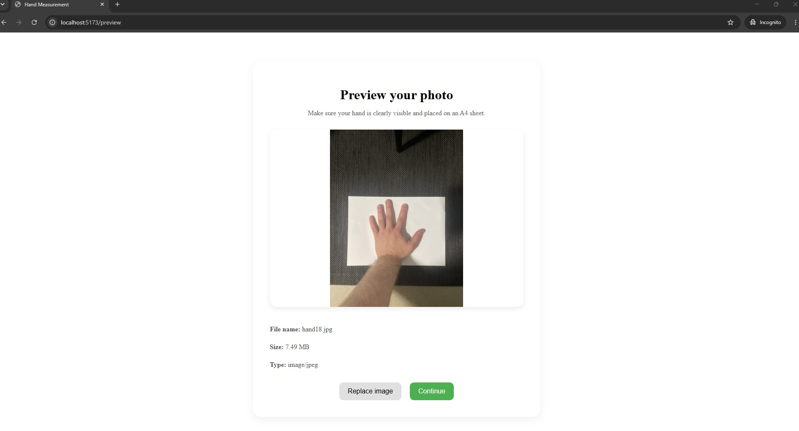
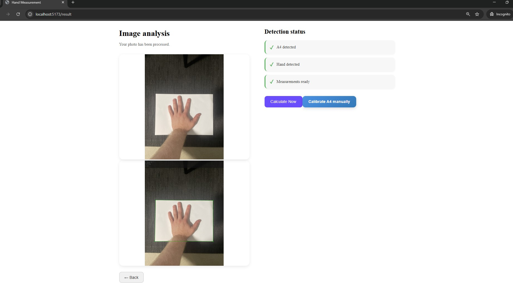
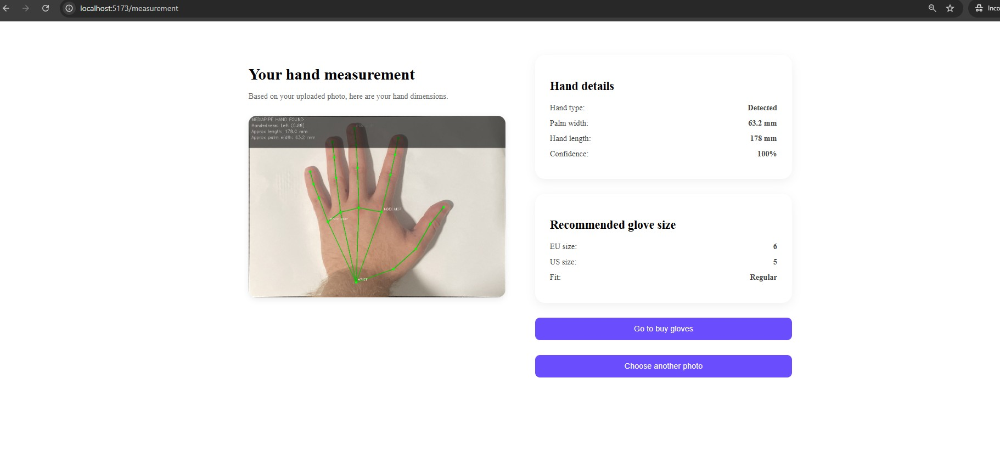
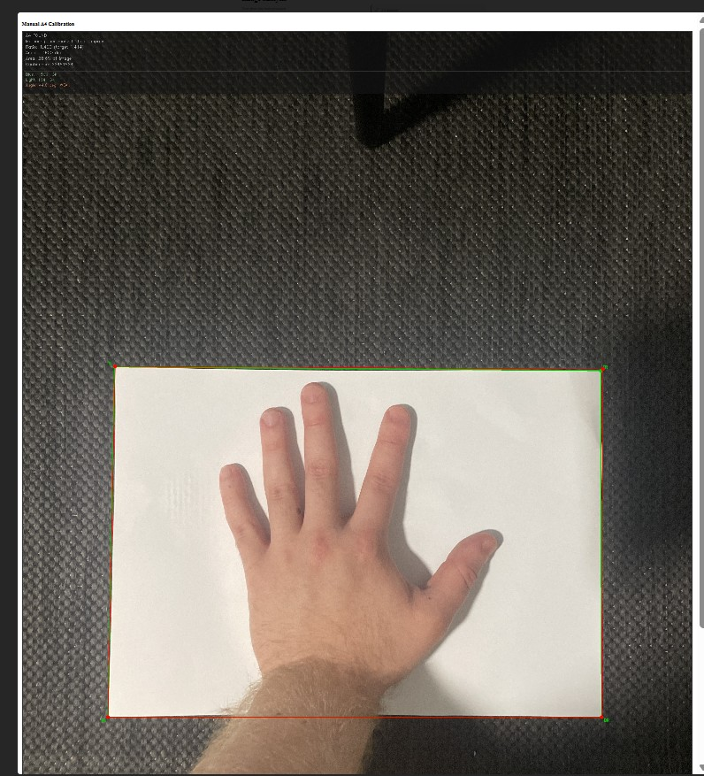

# Project Situation Report July

## General overview

Web application for estimating hand measurements from a photo, using A4 paper as a reference object. Further explanations below.

## User flow

| Step | Page | What happens |
|---|---|---|
| 1 | `frontend/src/pages/UploadPage.jsx` | User uploads or selects an image. Image is sent to backend automatic hand landmark endpoint |
| 2 | `frontend/src/pages/PreviewPage.jsx` | User reviews uploaded photo and continues to analysis |
| 3 | `frontend/src/pages/ResultPage.jsx` | Frontend shows detection status for A4, hand, and measurements. It also fetches A4 debug overlay from the backend |
| 4 | `frontend/src/components/ManualCalibrationModal.jsx` | If automatic A4 detection is not good enough, user can manually adjust A4 corner points |
| 5 | `frontend/src/pages/MeasurementPage.jsx` | Final page shows the processed image, hand length and palm widht |

## Structure

Backend handles image processing, CV side, Mediapipe hand landmarks (hand detection), A4 warping and measurement calculations.
Backend is separated into routes and services, where route files define API endpoints and service files on the other hand contain the logic for A4 detection, warping, overlays(good addition for debugging in swagger), hand detection and quality checks.

Frontend handles user interface, image upload, result display and also manual calibration that is used as a fail-safe if automatic detection is not providing satisfying results.

---

# Backend

## Backend hierarchy

| Path | Purpose |
|---|---|
| `backend/` | Backend root folder containing the FastAPI app, helper scripts, dependencies, and environment files |
| `backend/app/` | Main backend application package |
| `backend/app/main.py` | Fastapi app entry point. Registers routes and configures CORS so the frontend can "call" the backend |
| `backend/app/models/` | For now stores mediapipe's hand landmarker file |
| `backend/app/models/hand_landmarker.task` | MediaPipe hand landmark model (Instructions to download this in /models folder Readme.md)|
| `backend/app/routes/` | Contains FastAPI endpoint definitions |
| `backend/app/services/` | Contains image processing and measurement logic |
| `backend/pick_corners.py` | Local develpment helper (for swagger use) for manually clicking A4 corners and printing coordinates |

## Backend route files

| File | Functionality |
|---|---|
| `upload.py` | Image upload endpoint. Returns JSON with image size, A4 detection result, and debug image data |
| `upload_debug.py` | Returns an A4 debug overlay image, also exposing A4 corner coordinates through response headers for frontend calibration |
| `upload_warp_debug.py` | Returns the warped A4 image |
| `upload_compare_debug.py` | Returns side by side debug image comparing original detection and warped A4 output |
| `upload_hand_landmarks_debug.py` | Automatic measurement endpoint. Detects A4 automatically -> warps it -> runs MediaPipe hand detection ->returns processed debug image + measurement headers |
| `upload_hand_landmarks_manual_debug.py` | Manual measurement endpoint for testing manual reference object point calibration on the backend side|

## Backend service files

| File | Functionality |
|---|---|
| `a4_detection.py` | Detects A4 paper and returns if A4 was found, corner coordinates, ratio, angle, confidence, and detection method |
| `a4_warp.py` | Uses A4 corners to perform perspective correction. Also calculates px per mm scale values from A4 |
| `debug_overlay.py` | Draws visual debug overlays: A4 boundaries,confidence, angle, and quality warning information |
| `hand_landmarks.py` | Loads MediaPipe hand model, detects 21 hand landmarks, draws landmark debug lines and estimates hand length and palm width |
| `image_processing.py` | Coordinates the JSON upload flow used by the basic /upload route |
| `quality_check.py` | for debugging, checjks image quality checks such as blur, lighting, and tilt warnings |

# Frontend

## Frontend hierarchy

| Path | Purpose |
|---|---|
| `frontend/` | React Vite frontend root folder |
| `frontend/src/main.jsx` | React entry point |
| `frontend/src/App.jsx` | Main app component Loads the router |
| `frontend/src/router.jsx` | Defines frontend routes: upload, preview, result, and measurement pages |
| `frontend/src/pages/` | Main application pages |
| `frontend/src/components/` | UI components |
| `frontend/src/styles/` | CSS styling files for pages and components |

## Frontend pages

| File | Functionality |
|---|---|
| `UploadPage.jsx` | Upload screen. Sends the image to the backend automatic hand landmark endpoint |
| `PreviewPage.jsx` | Shows uploaded image and file information before continuing to result analysis |
| `ResultPage.jsx` | Shows the uploaded image, A4 debug overlay image, detection status, and manual calibration option |
| `MeasurementPage.jsx` | Shows final measurement results, processed debug image if available, and estimated glove size |

## Frontend components

| File | Functionality |
|---|---|
| `UploadZone.jsx` | Drag and drop or click2upload image component, validates image type and file size |
| `CanvasOverlay.jsx` | Canvas component for showing and dragging A4 corner points on top of an image ->Converts coordinates into real image coordinates |
| `ManualCalibrationModal.jsx` | Model that lets the user adjust A4 corners manually and send those coordinates to backend manual measurement endpoint |

## Frontend styles

| File | Purpose |
|---|---|
| `upload.css` | Styles upload page |
| `preview.css` | Styles preview page |
| `result.css` | Styles image result page |
| `measurement.css` | Styles final measurement page |
| `calibration.css` | Styles canvas calibration UI |
| `ManualCalibrationModal.css` | Styles manual calibration model |

---

# Current status

Currently backend and frontend integration has been done. Frontend can upload an image, receive measurement values from the backend, show analysis status, and display final hand measurement results. Backend can detect A4 paper, warp the image, run mediapipe hand landmarks and estimate measurements.

Now also included a manual calibration for reference object, if automatic one fails. (bad lightning, light reflections or covered corners can ruin the result of automatic detection)

## Known improvement areas

 Palm width accuracy: currently from pinky finger's "knuckle" to index finger's "knuckle". Later improvement will focus on improving the detection accuracy by using possibly contours or masks to assist.

 Frontend: UI improvements, make it more "aesthetic" and user friendly. Also keep responsivness in mind.

## Current user flow in images

