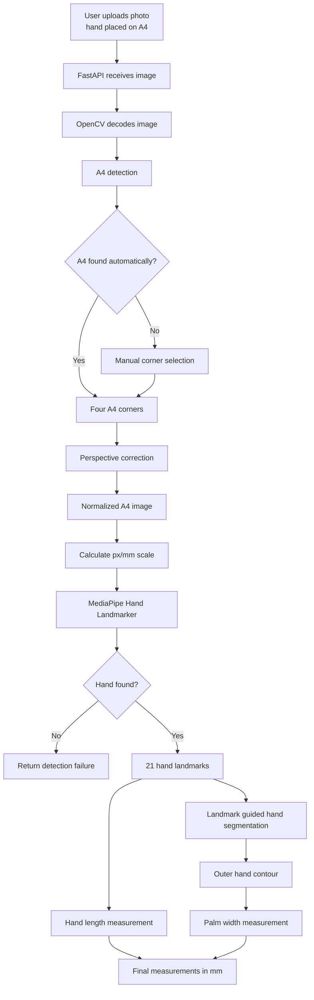
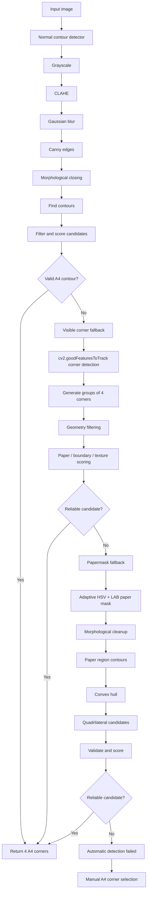
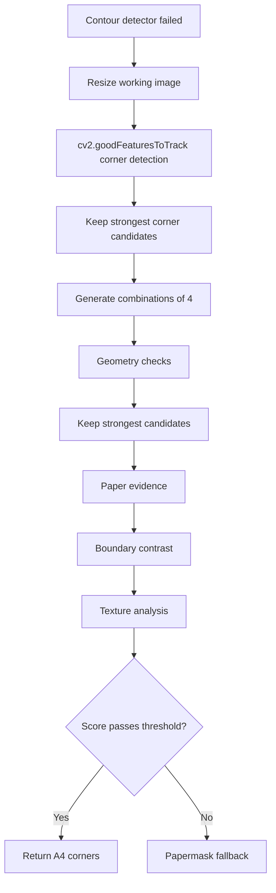
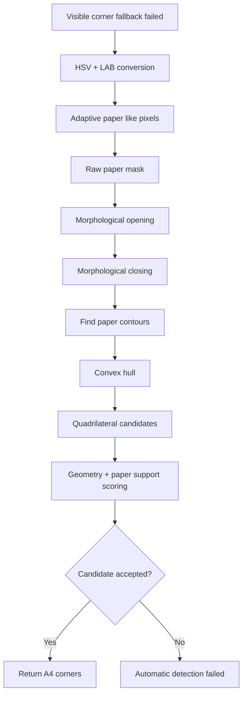
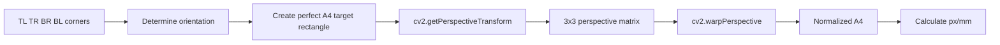
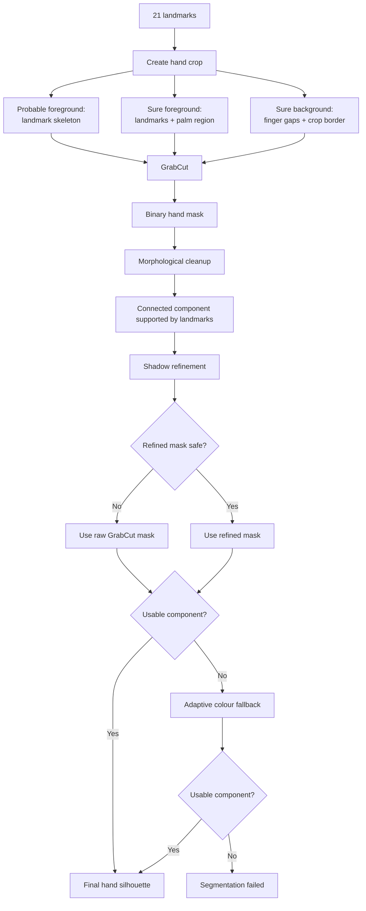

# How the project works

The application measures a hand from an image where the hand is placed on A4 sheet. The A4 sheet acts as a **reference object with known physical dimensions**, allowing pixel measurements from the image to be converted into millimetres.

The backend uses a **"hybrid" computer vision pipeline**:

- **FastAPI** handles uploads and API endpoints.
- **OpenCV** handles most image processing and classical computer vision.
- **NumPy** handles arrays, coordinates and vector calculations.
- **MediaPipe Hand Landmarker** provides 21 anatomical hand landmarks using a trained machine learning model.
- OpenCV then uses those landmarks as guidance for hand segmentation and physical measurement.


## 1. High level workflow



The core idea is:

> **First detect and normalize the A4 sheet, then use its known physical size to establish scale. After that, detect the hand and measure it in normalized coordinate system.**


## 2. Backend structure

The backend separates HTTP/API handling from the computer vision services.

```text
FastAPI routes
    ↓
Receive uploads and return responses

Service modules
    ↓
A4 detection
Perspective correction
Quality checks
Hand landmarks
Hand segmentation
Measurements

OpenCV / MediaPipe / NumPy
    ↓
Actual image processing algorithms
```

Important files:

| File | Responsibility |
|---|---|
| `app/main.py` | Creates the FastAPI application, configures CORS and registers routes |
| `app/routes/upload.py` | Basic image upload endpoint |
| `app/routes/upload_debug.py` | A4 detection debug image |
| `app/routes/upload_warp_debug.py` | Perspective corrected A4 debug image |
| `app/routes/upload_compare_debug.py` | Original detection and warped A4 side by side |
| `app/routes/upload_paper_mask_debug.py` | Raw/cleaned papermask debugging |
| `app/routes/upload_hand_landmarks_debug.py` | Main automatic A4 → hand → measurement debug flow |
| `app/routes/upload_hand_landmarks_manual_debug.py` | Manual A4 corners → same downstream hand pipeline |
| `app/services/a4_detection.py` | Automatic A4 detection and fallback methods |
| `app/services/a4_warp.py` | Perspective correction and px/mm calibration |
| `app/services/hand_landmarks.py` | MediaPipe, segmentation and hand measurements |
| `app/services/quality_check.py` | Blur, brightness and tilt checks |
| `app/services/debug_overlay.py` | Draws visual debug information |
| `app/services/image_processing.py` | Shared image decoding and A4 processing |

---

## 3. A4 detection

Main file:

```text
backend/app/services/a4_detection.py
```

Automatic A4 detection uses three methods in order:

```text
1. Normal contour detector
        ↓ if unsuccessful
2. Visible corner fallback
        ↓ if unsuccessful
3. Papermask fallback
        ↓ if unsuccessful
4. Automatic detection fails → manual corners can be used
```

### A4 detection flow



### 3.1 Preferred method: contour detection

The preferred detector runs:

1. **Grayscale conversion**
2. **CLAHE** local contrast enhancement
3. **Gaussian blur**
4. **Canny edge detection**
5. **Morphological closing**
6. **Contour detection**
7. **A4 candidate filtering and scoring**

Important candidate checks include:

- candidate area,
- A4-like side ratio,
- solidity,
- internal edge density.

The physical A4 ratio is:

```text
297 / 210 ≈ 1.414
```

The detector uses longer side / shorter side so portrait and landscape both work.

When a candidate passes the filters, the backend first tries to simplify the real contour into four corners. If this is not reliable, `minAreaRect` provides backup corners.

All corners are ordered:

```text
TL → TR → BR → BL
```

because perspective correction requires a stable point order.

---

## 4. Visible corner fallback

The normal contour detector can fail if the hand or its shadow breaks the visible paper boundary.

The first fallback therefore detects strong image corners and asks whether four of them form a believable A4 sheet.



The current implementation asks OpenCV for up to 40 strong corners and keeps 26. `itertools.combinations()` then generates possible four corner groups.

Cheap geometry filtering is performed first because 26 choose 4 creates roughly 15,000 possible groups.

A candidate is checked for:

- convex quadrilateral geometry,
- reasonable area,
- A4-like ratio,
- opposing side balance,
- plausible corner angles.

The strongest geometry candidates are then checked using image evidence:

- paper like pixels inside the quadrilateral,
- support near corners and sides,
- paper to background boundary contrast,
- interior texture.

Sobel gradients and Canny edges help reject highly textured backgrounds such as carpet or fabric.

---

## 5. Papermask fallback

If visible corner detection also fails, the final automatic fallback detects the likely paper region using colour and brightness.



The detector uses:

- **HSV saturation/value**
- **LAB lightness**

to identify bright, low-saturation regions that resemble paper.

Thresholds are adaptive to the current image instead of assuming that paper must be pure white.

The cleaned paper region produces several possible quadrilaterals using:

1. `approxPolyDP`
2. extreme hull points
3. `minAreaRect`

The candidates are checked using A4 geometry and paper support around the area, corners and sides.

---

## 6. Known A4 limitation

The current source code documents a known limitation:

> The visible corner and papermask fallbacks can sometimes produce false A4 detections when no A4 sheet is present.

Stricter fixes have been tested, but they also rejected some valid A4 photographs.

The intended capture guideline helps reduce this problem:

```text
One hand on a clearly visible A4 sheet
with all four A4 corners visible.
```

If automatic corner detection fails, the application also supports manually provided A4 corners.

---

## 7. Perspective correction and calibration

Main file:

```text
backend/app/services/a4_warp.py
```

Once four corners are available, the photographed A4 is perspective corrected.



Output sizes:

```text
Portrait:
794 × 1123 px
=
210 × 297 mm

Landscape:
1123 × 794 px
=
297 × 210 mm
```

Because both the pixel size and physical A4 size are known, the backend calculates:

```text
px_per_mm_x
px_per_mm_y
px_per_mm_avg
```

This calibration is what converts later image measurements from pixels into millimetres.

---

## 8. MediaPipe hand detection

Main file:

```text
backend/app/services/hand_landmarks.py
```

The backend expects the model file at:

```text
backend/app/models/hand_landmarker.task
```

The model is loaded on first use and the created landmarker instance is cached.

Current configuration:

```text
Running mode: IMAGE
Hands: 1
Minimum detection confidence: 0.5
Minimum hand-presence confidence: 0.5
Minimum tracking confidence: 0.5
```

OpenCV images are BGR, while MediaPipe expects RGB, so the normalized A4 image is converted before inference.

MediaPipe returns 21 hand landmarks. Important ones include:

```text
0  = Wrist
5  = Index MCP
9  = Middle MCP
12 = Middle fingertip
13 = Ring MCP
17 = Pinky MCP
```

Normalized MediaPipe coordinates are converted into pixel coordinates on the warped A4.

---

## 9. Hand length

Hand length is defined as:

```text
Landmark 0: wrist
        ↓
Landmark 12: middle fingertip
```

The X and Y pixel differences are separately converted with the A4 scale, then combined into physical straightline distance.

---

## 10. Palm-width reference

MediaPipe does **not** directly return palm width.

The backend calculates an internal reference between:

```text
Landmark 5: index MCP
        ↔
Landmark 17: pinky MCP
```

These points could be demonstrated as from index finger's knuckle to pinky finger's knucle, so this value usually underestimates true outer palm width leaving the outer palm width out from both sides.

It is mainly used for:

- geometry,
- sanity checks,
- scaling search distances,
- final fallback if contour measurement fails.

---

## 11. Landmark guided GrabCut segmentation

The preferred hand silhouette is created using **GrabCut guided by MediaPipe landmarks**.



### GrabCut guidance

The backend creates four kinds of information:

```text
Probable foreground
Sure foreground
Probable background
Sure background
```

MediaPipe skeleton lines and larger landmark regions provide probable foreground.

Smaller landmark regions and a central palm polygon provide sure foreground.

The crop border and selected finger gap regions provide sure background.

### Fingergap handling

Safe regions between fingers are marked as background. This helps prevent dark shadows from joining two fingers into one foreground blob.

### Deterministic processing

Before GrabCut runs:

```python
cv2.setRNGSeed(12345)
```

is used so repeated processing starts OpenCV's random dependent operations from same state.

GrabCut then runs for four iterations.

### Cleanup and shadow refinement

The binary mask receives small opening and closing operations.

The backend then tries to remove attached neutral shadows using image specific LAB and HSV colour information.

A refined result is accepted only if it still preserves enough hand area and MediaPipe landmark support.

If GrabCut fails completely, an adaptive colour segmentation fallback is attempted.

---

## 12. Final hand contour

After segmentation, connected component analysis is used to select the foreground object supported by the hand landmarks.

The selected external contour is filled into a solid silhouette so small internal holes do not interfere with width measurement.

This contour becomes the real outside hand boundary used by the preferred palm width algorithm.

---

## 13. Palm width measurement hierarchy

```text
1. MCP sideray outer contour method
        ↓ if unreliable
2. MCP band parallel line fallback
        ↓ if unreliable
3. Landmark 5 → 17 fallback
```

### Preferred method: MCP side rays

The backend calculates a palm axis from:

```text
wrist → average MCP centre
```

It then samples the MCP level and several nearby levels slightly toward the wrist.

At each level:

1. Start close to the index and pinky MCP regions.
2. Move the starting point inside the hand mask if necessary.
3. Trace outward independently on both sides.
4. Confirm the contour edge using a stable run of background pixels.
5. Measure between the two detected outer edges.
6. Convert the result to millimetres.

Several candidate widths are collected.

They are checked against:

- landmark 5 → 17 width,
- total hand length,
- consistency with other nearby samples.

At least two consistent sideray measurements are required. The final result is the median of the accepted inliers.

### MCP band fallback

If side rays fail, several full parallel lines are tested slightly below the MCP knuckles.

At least three stable measurements are required, and the nearby samples must agree closely enough.

The median becomes the backup outer palm width.

### Final fallback

If no trustworthy outer contour measurement exists:

```text
landmark 5 → landmark 17
```

is returned instead.

The backend records the selected method:

```text
outer_contour_mcp_side_rays
outer_contour_mcp_band
landmark_5_to_17_fallback
```

---

## 14. Automatic vs manual A4 calibration

Automatic path:

```text
Image
→ automatic A4 detection
→ perspective correction
→ px/mm scale
→ MediaPipe
→ segmentation
→ measurement
```

Manual path:

```text
Image + manually selected A4 corners
→ perspective correction
→ px/mm scale
→ MediaPipe
→ segmentation
→ measurement
```

Manual mode only replaces the automatic A4 corner stage. Other than that, measurement pipeline is reused.

---

## 15. Image-quality checks

`quality_check.py` can assess:

- blur using **Laplacian variance**,
- average brightness,
- approximate tilt using **Canny + probabilistic Hough lines**.

These quality checks are advisory. They generate warnings for debugging but do not directly stop A4 detection.

---

## 16. Main debug outputs

The project contains several visual debug endpoints:

- **A4 debug** — draws the A4 boundary and corner order.
- **Warp debug** — shows the perspective corrected A4.
- **Compare debug** — original detection and warped A4 side by side.
- **Papermask debug** — original image, raw mask, cleaned mask and final A4 result.
- **Hand debug** — MediaPipe skeleton, key landmarks, hand contour, measurement lines and selected methods.

The main automatic hand debug route follows:

```text
upload
→ detect A4
→ warp
→ scale
→ MediaPipe
→ measurements / segmentation
→ debug image
```

---

## 17. Classical CV vs machine learning

| Stage | Approach |
|---|---|
| A4 detection | Classical computer vision |
| A4 fallbacks | Geometry + image heuristics |
| Perspective correction | Projective geometry |
| Hand landmarks | MediaPipe machine learning |
| Hand mask | OpenCV segmentation guided by ML landmarks |
| Palm width | Binary mask tracing + geometry |
| Hand length | Landmark geometry + A4 calibration |

So its safe to say technical wise:

> **Project combines classical OpenCV computer vision with MediaPipe machine learning. OpenCV detects and normalizes the A4 reference, MediaPipe provides semantic hand landmarks, and those landmarks guide OpenCV segmentation and physical measurement.**

---

## 18. Main algorithms and techniques

### A4

- CLAHE
- Gaussian blur
- Canny
- Morphological closing
- Contour analysis
- Solidity
- A4 aspect ratio checks
- Convex hulls
- `approxPolyDP`
- `minAreaRect`
- Shi-Tomasi corners
- Four-point combinations
- HSV / LAB paper masks
- Sobel gradients
- Boundary contrast
- Perspective transformation

### Hand

- MediaPipe Hand Landmarker
- 21 landmarks
- GrabCut
- Landmark-guided foreground/background seeds
- Fingergap background masks
- Morphological cleanup
- Connected components
- LAB / HSV shadow refinement
- Adaptive colour fallback
- Outer contour extraction
- MCP side rays
- MCP band fallback
- Median / outlier filtering
- Pixel to mm conversion

---


## 19. One-sentence summary

> **Detect the A4 → correct perspective → establish millimetre scale → detect hand landmarks → segment the hand → measure the real hand geometry.**

---

## Related documentation

Testing and measurement results are documented separately in:

```text
docs/Testing_results.md
```
